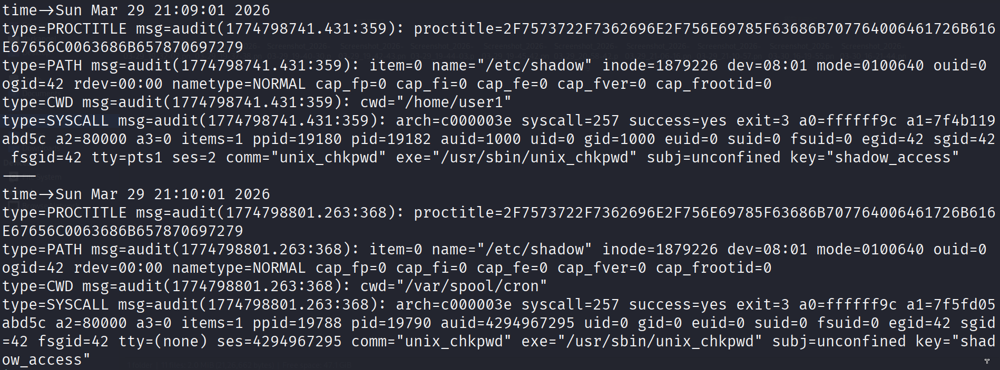
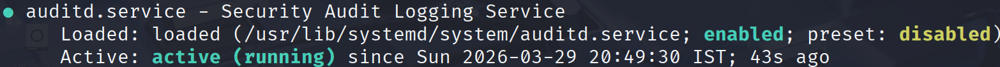

# 🛡️ Linux SOC Incident Investigation Lab

## 📌 Overview

This project simulates a real-world **Linux security incident investigation** conducted from a Security Operations Center (SOC) perspective.

The objective is to analyze system activity, identify indicators of compromise (IOCs), and reconstruct attacker behavior using host-based artifacts.

The investigation focuses on detecting:

* Privilege escalation
* Persistence mechanisms
* Log tampering (anti-forensics)
* Unauthorized access to sensitive files

---

## 🚨 Incident Scenario

A Linux server was flagged for suspicious activity, including irregular authentication logs and unexpected system behavior.

During analysis, the following concerns were identified:

* Unusual privilege escalation events
* Suspicious scheduled task execution (cron)
* Gaps and inconsistencies in system logs
* Potential access to sensitive credential files

The system is assumed to be **post-compromise**, and the goal is to determine:

> *What happened, how it happened, and what evidence supports it.*

---

## 🎯 Objectives

* Investigate authentication logs for unauthorized access
* Identify privilege escalation patterns
* Detect persistence mechanisms (cron-based)
* Analyze logs for tampering or inconsistencies
* Investigate access to sensitive files (e.g., `/etc/shadow`)
* Reconstruct a timeline of attacker activity
* Develop basic detection logic for similar threats

---

## 🧪 Methodology

The investigation follows a structured SOC workflow:

1. **Log Analysis**

   * Reviewed `/var/log/auth.log` for authentication anomalies
   * Identified suspicious login patterns and privilege changes

2. **Persistence Detection**

   * Analyzed cron jobs in `/etc/crontab` and user cron directories
   * Detected execution of scripts from non-standard locations (e.g., `/tmp`)

3. **Process & System Inspection**

   * Examined running processes and system snapshots
   * Identified abnormal or unauthorized activity

4. **Log Integrity Verification**

   * Detected missing entries and timestamp inconsistencies
   * Assessed likelihood of log tampering

5. **Sensitive File Access Analysis**

   * Investigated access patterns to critical files such as `/etc/shadow`

---

## 🔍 Key Findings

* **Privilege Escalation:**
  Evidence of unauthorized elevation to root via `sudo`

* **Persistence Mechanism:**
  Malicious cron job executing from `/tmp`, indicating attacker foothold

* **Log Tampering Indicators:**
  Missing log sequences and inconsistencies suggesting anti-forensic activity

* **Sensitive File Access:**
  Access to `/etc/shadow`, indicating potential credential compromise

---

## 🕒 Timeline of Compromise

A structured timeline of attacker activity has been reconstructed, including:

* Initial access
* Privilege escalation
* Persistence establishment
* Evidence tampering
* Sensitive data access

Full timeline available in: `incident_report.md`

---

## 🚨 Indicators of Compromise (IOCs)

* Suspicious `sudo` activity
* Cron jobs executing from temporary directories
* Gaps or truncation in authentication logs
* Unauthorized access to `/etc/shadow`
* Unknown or abnormal processes

---

## 🛡️ Detection Engineering

Basic host-based detection was implemented using **auditd**:

* Monitoring access to sensitive files (`/etc/shadow`)
* Identifying abnormal privilege usage
* Detecting persistence mechanisms via cron anomalies

Detection logic and implementation:
`detection_playbook.md`

---

## 📁 Project Structure

```
linux-soc-investigation-lab/
├── README.md
├── incident_report.md
├── detection_playbook.md
├── artifacts/
│   ├── auth.log
|
├── sanitize_logs.sh
│
├── detections/               
│   ├── auditd_status.png
│   ├── auditd_rule.png
│   ├── auditd_detection.png
```

---

## ⚙️ Skills Demonstrated

* Linux log analysis (`auth.log`)
* Incident investigation & timeline reconstruction
* Privilege escalation detection
* Persistence detection (cron jobs)
* Log tampering identification (anti-forensics)
* IOC identification and reporting
* Basic detection engineering (auditd)

---

## 📸 Key Detections Evidence

### Auditd Rules Applied


### Detection of Sensitive File Access


### Auditd Service Status


---

## 📄 Full Incident Report

A complete timeline-based investigation report is available here:

[View Incident Report](./incident_report.md)

---

## ⚠️ Disclaimer

This project was conducted in a controlled lab environment for educational purposes.
All data has been sanitized to remove sensitive information.

---

## 🚀 Why This Project Matters

This project demonstrates the ability to:

* Think like a SOC analyst during incident response
* Move beyond basic log reading into **evidence-driven investigation**
* Correlate multiple data sources into a coherent attack narrative
* Apply foundational detection engineering concepts

These are core skills required for **SOC Analyst (L1/L2)** and **Blue Team roles**.
